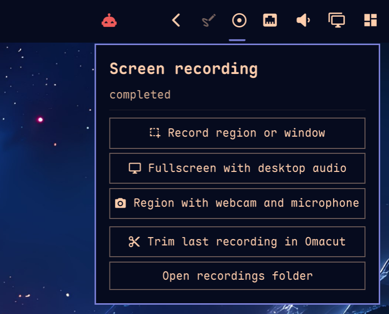

# omarec

Screen recording for Omarchy and Hyprland. GPU Screen Recorder still captures
the frames; omarec owns the session: start, pause, stop, recovery, and the
file that lands in `Videos/Screenrecordings`.



That is `omarec menu` and the Omarchy bar dropdown. Left click the bar chip
for the same card; right click pauses; middle click stops.

## Install on Omarchy

From this tree:

```bash
./install-omarchy
```

The installer uses Omarchy's package helper for missing dependencies, builds in
`~/.cache/omarec`, and installs under `~/.local`. It enables the user units,
installs the `community.omarec` plugin, and does not modify Hyprland
configuration or merge the capture-menu template.

Set `OMAREC_PREFIX` before running `install-omarchy` to use a prefix other than
`~/.local`.

On Arch without Omarchy, or to reuse an existing build:

```bash
bash scripts/install-user.sh
```

`--skip-build`, `--skip-deps`, and `--no-plugin` are optional. Or build the Arch
package in `integration/arch/`. Rollback to the packaged legacy recorder:

```bash
export OMAREC_SCREENRECORDING=0
```

## Quickstart

```bash
omarec doctor
omarec menu
```

Or from a terminal without the overlay:

```bash
omarec start --monitor DP-1 --output "$HOME/Videos/Screenrecordings/test.mp4"
omarec status
omarec stop --wait
```

`start` returns after durable admission. First frame and completion arrive through `status` / `watch`.

## UI

- **Omarchy bar:** `community.omarec` plugin — elapsed chip and an anchored dropdown. See the [plugin README](integration/quickshell/community.omarec/README.md).
- **Anywhere:** `omarec menu` is the labeled card. `omarec menu --compact` is a
  horizontal icon pill (region / fullscreen / webcam, or pause / stop).
- **Keybinds:** the dispatcher toggles start/stop.

While recording, the bar chip shows elapsed time:


When paused, the chip changes state and keeps the elapsed time visible:


```bash
omarec menu
omarec menu --compact
systemctl --user enable --now omarec-notify.service
```

The session PATH may resolve a bare `omarchy-capture-screenrecording` to Omarchy's legacy script. The plugin, `omarec menu`, and the menu template prefer `~/.local/bin` when `omarec` is there, then `/usr/bin` only if `/usr/bin/omarec` exists.

## Docs

- [CONTRIBUTING.md](CONTRIBUTING.md) — toolchain, architecture rules, and review expectations.
- [plugin README](integration/quickshell/community.omarec/README.md) — bar chip and dropdown.
- [tests/fixtures/README.md](tests/fixtures/README.md) — pinned parser and parity evidence.

## Toolchain

Rust **1.97.1** (pinned), MSRV **1.95**, edition 2024, GPU Screen Recorder **6.x**.

```bash
rustup toolchain install 1.97.1 --component clippy,rustfmt
bash scripts/check.sh
```
